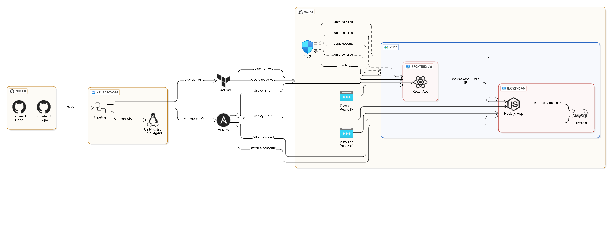
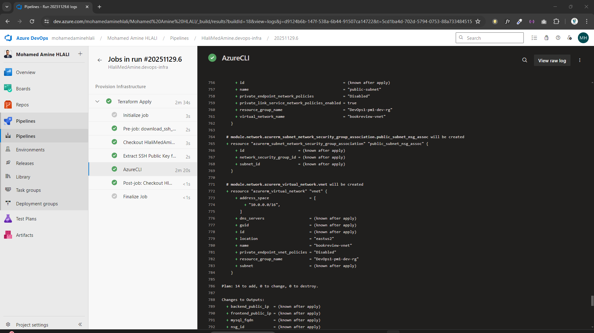
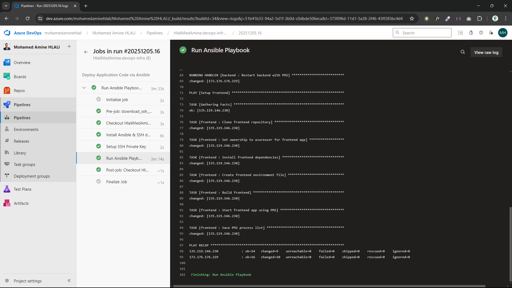
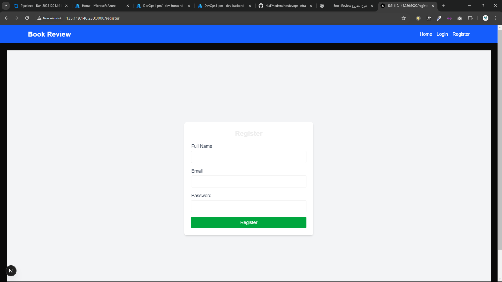
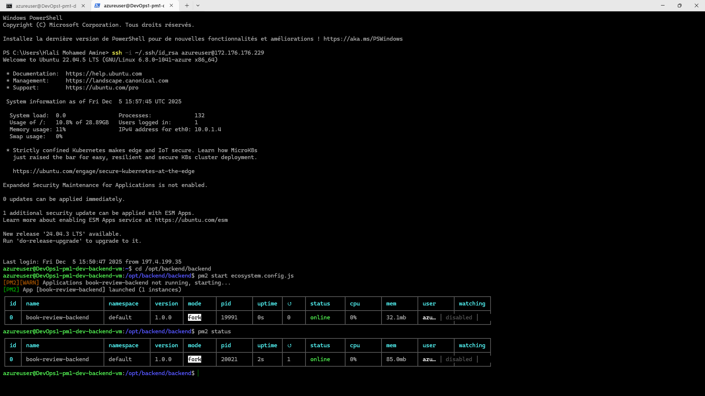
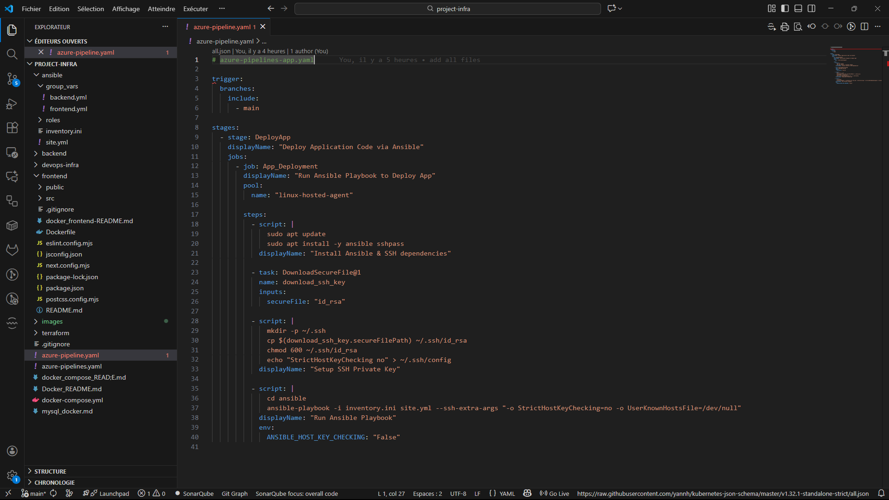

# Book Review DevOps Project – Full CI/CD, IaC & Automation

## 📌 Project Overview
This project demonstrates a complete **Production-Ready DevOps pipeline** deployed on Microsoft Azure using Terraform, Ansible, Azure DevOps, GitHub, PM2, and Linux servers.  
It includes provisioning infrastructure, deploying backend & frontend applications, and automating configuration using best DevOps practices.

## 📘 Architecture Overview

---

# 📸 Project Images (Organized by Progress Steps)

## **1️⃣ Terraform Infrastructure Deployment**
- Terraform Plan & Apply  
- Azure resources created  
- Network, VMs, NSG

**Images:**  

---

## **2️⃣ Ansible Deployment Pipeline**
- Ansible installing dependencies  
- Backend & Frontend deployment  
- PM2 restart & handlers

**Images:**  

---

## **3️⃣ Azure Infrastructure Overview**
- Resource Group  
- VMs  
- NICs  
- Public IPs  
- Network security

**Images:**  

---

## **4️⃣ Application Running on Azure**
- Frontend (React)
- Register / Login screen
- API connectivity

**Images:**  

---

## **5️⃣ Backend Server & PM2**
- SSH to backend VM  
- PM2 app list  
- Logs & service

**Images:**  

---

## **6️⃣ VS Code Configuration**
- Pipelines YAML  
- File structure  
- Ansible playbooks  
- Terraform modules

**Images:**  

---

# 🛠 Full Project Explanation

## 🚀 1. Git & GitHub – Source Code Management
Key skills implemented:
- Created and managed Git repositories
- Uploaded source code from VS Code to GitHub
- Used git add, commit, push, pull
- Organized backend & frontend repositories
- Connected GitHub with Azure DevOps pipelines
- Ensured security by preventing sensitive files from being pushed

---

## 🛠 2. Azure DevOps – CI/CD Pipelines
Automated pipelines built:

### **Terraform Pipeline**
- Initializes Terraform backend  
- Runs terraform init, plan, apply  
- Deploys complete Azure infra  

### **Ansible Pipeline**
- Installs Ansible & sshpass  
- Downloads SSH private key via Secure Files  
- Executes playbooks to deploy backend & frontend  

Additional skills:
- Triggers  
- Secure files  
- Service connections  
- Pipeline debugging  

---

## 🖥 3. Self-Hosted Linux Agent
Configured Azure DevOps to use a custom Linux VM:
- Installed agent binaries  
- Connected VM to Azure DevOps Agent Pool  
- Ran CI/CD pipelines through it  

---

## 🔐 4. Service Principal & Service Connection
Configured authentication:
- Created Service Principal via Azure CLI  
- Gathered Client ID, Secret, Tenant, Subscription  
- Linked SPN with Azure DevOps  

---

## 🌎 5. Terraform – Infrastructure as Code
Infrastructure deployed:
- Virtual Network  
- Subnets  
- NSG  
- Public & Private IP  
- Backend VM  
- Frontend VM  
- NICs & disks  

Modules:
- Network  
- Compute  
- MySQL  

---

## 🌐 6. Azure Networking
Networking architecture implemented:
- Secure NSG rules for each VM
- Allowed only necessary ports (22, 3000, 3306)
- Restricted DB access to backend only
- Used Public IPs for VM access and testing
- Correct handling of Private IPs inside Ansible

---

## 🐧 7. Linux Administration
Successfully managed Linux servers:
- SSH login using private key
- Created directory structures for backend & frontend
- Installed Node.js
- Installed MySQL server
- Modified `mysqld.cnf` for remote access
- Used nano, systemctl, ufw firewalls
- Read system logs and PM2 logs

---

## 🤖 8. Ansible – Configuration Management
### Backend Playbook
- Clone backend repository
- Install npm dependencies
- Create `.env` dynamically
- Create PM2 ecosystem file
- Start backend service with PM2
- Restart handler on new deployments
- Create MySQL database & user

### Frontend Playbook
- Clone frontend repository
- Install dependencies
- Build React app
- Run React app using PM2

This ensures fully automated deployments.

---

## 🛢 9. MySQL Database
Database set up inside a Linux VM:
- Installed MySQL server
- Allowed remote connections
- Created custom DB + users
- Verified backend connection
- Fixed permission & authentication issues

---

## 🔄 10. PM2 – Application Process Manager
Used PM2 to manage Node.js services:
- Start, stop, restart backend
- Load ecosystem file
- Monitor logs
- Ensure app stays alive after reboot

---

## 🐞 11. Debugging & Problem Solving
More than **40+ real issues** solved:
- Terraform validation errors  
- SSH permission issues  
- Inventory & host file problems  
- Ansible task failures  
- Missing environment variables  
- PM2 misconfigurations  
- Network & firewall issues  
- Database authentication failures  

This built true real-world DevOps understanding.
---

## 🎯 Final Result – What the Project Achieved
You now have a fully automated DevOps pipeline capable of:

### ✔ Deploying Azure Infrastructure Automatically (Terraform)  
### ✔ Installing Software & Deploying Code Automatically (Ansible)  
### ✔ Running CI/CD Pipelines on a Self-Hosted Agent  
### ✔ Hosting a Full Application:  
- **Backend Node.js API**  
- **Frontend React App**  
- **MySQL Database**  

## 👑 Conclusion
This project is **production-grade** and covers the full cycle of:

> **Infrastructure → Automation → Deployment → Debugging → Delivery**

It demonstrates real skills that companies expect from a **DevOps Engineer**.

---

## 👨‍💻 Engineer Information

**Mohamed Amine Hlali**  
*DevOps & Cloud Engineer*  
Expertise: AWS, Kubernetes, Docker, GitLab CI/CD, Monitoring, IaC, SAST & Code Quality  

